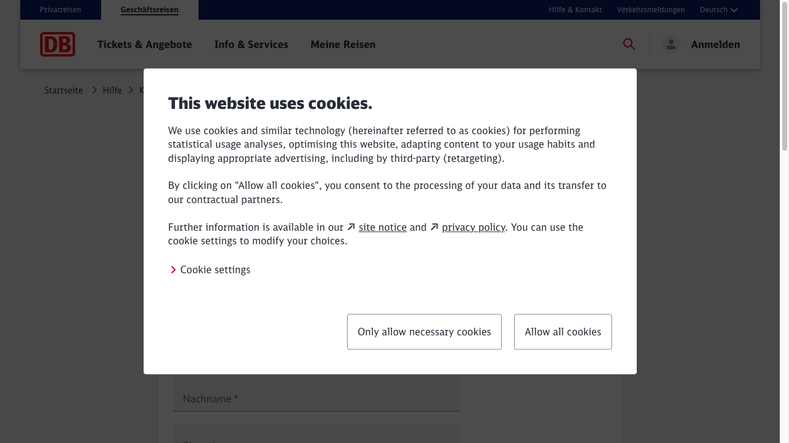
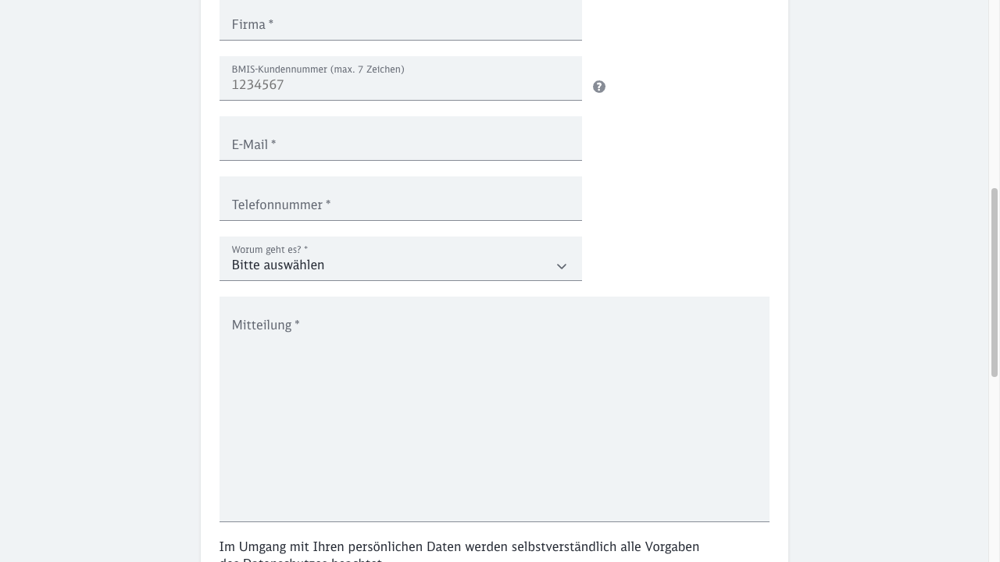
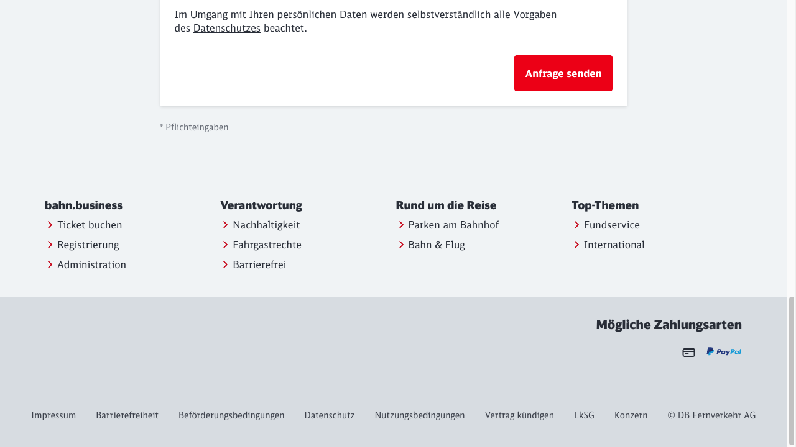

# Test Case: TC001 - Submit Contact Request via DB Website

## Test Case Description
Submit Contact Request via DB Website

## Pre-conditions
- Navigate to https://www.bahn.de/bahnbusiness/hilfe/kontakt-firmenkunden/kontaktformular-bahnbusiness
- Browser should be open and functional

## Test Steps

### Step 1: Open URL "https://www.bahn.de/bahnbusiness/hilfe/kontakt-firmenkunden/kontaktformular-bahnbusiness"
**Action:** Navigated to the DB contact form URL
**Expected Result:** Contact page loads successfully
**Actual Result:** Page loaded successfully, cookie consent banner appeared
**Evidence:** 
- screenshot:
**Status:** ✅ PASS
**Notes:** Cookie consent banner was displayed and had to be accepted before proceeding

### Step 1.1: Accept Cookies
**Action:** Clicked "Allow all cookies" to dismiss the cookie consent banner
**Expected Result:** Cookie banner should disappear and form should be accessible
**Actual Result:** Cookie banner disappeared successfully
**Evidence:** 
- screenshot:
**Status:** ✅ PASS
**Notes:** Required to access the form functionality

### Step 2: Select "General Information" as the topic of request
**Action:** Attempted to locate and interact with topic selection dropdown
**Expected Result:** Topic is selected successfully
**Actual Result:** The expected form structure was not found as described in test case
**Evidence:** 
- screenshot:
- screenshot:
**Status:** ❌ FAIL
**Notes:** The form structure differs from test case expectations. Found limited form fields including:
- "Worum geht es?" (What is it about?) dropdown - could be topic field
- Message field "Mitteilung"  
- Submit button "Anfrage senden"
- However, expected fields like subject, title, first name, last name, company, email, phone, country were not visible in standard form layout

